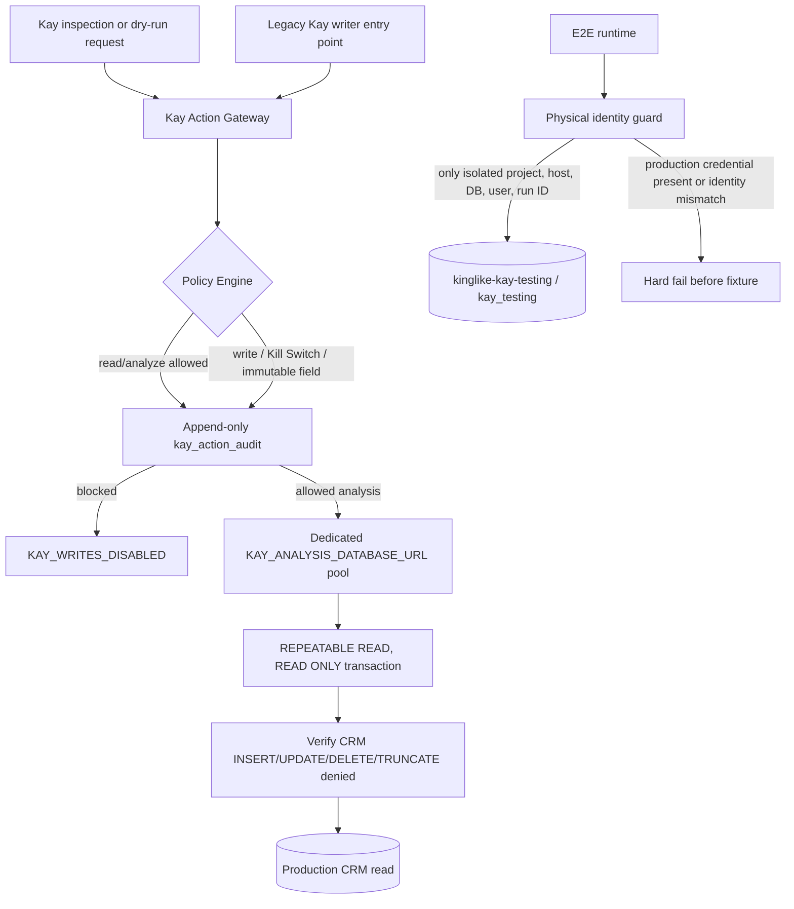

# Kay production safety architecture

## Enforced state

- Mode: `shadow`
- Kill Switch: on
- E.2.4: `FROZEN_NO_EXECUTION`
- Canary allowlist: empty
- Auto Rescue: off
- Capabilities enabled: `kay.crm.read`, `kay.crm.analyze`
- Capabilities disabled: `kay.tasks.create`, `kay.leads.reassign`,
  `kay.crm.write`, `kay.whatsapp.send`, `kay.rescue.execute`

No Kay scheduler starts at application boot. Kay HTTP mutations and legacy
service execution entry points fail with `KAY_WRITES_DISABLED`.

## Flow

## Customer identity immutability

The policy permanently rejects Kay requests naming customer identity fields:
lead/customer name, phone, email, Meta/external lead ID, original lead source,
original inbound payload, WhatsApp identity, and creation timestamp. This rule
is evaluated before any future write can be authorized.

## Production PostgreSQL role

The intended login is `kay_production_analysis`, supplied only through the
`KAY_ANALYSIS_DATABASE_URL` secret. The reviewed administrator template is
`artifacts/kay-postgres-readonly-role.sql`.

It grants only database CONNECT, schema USAGE, and table SELECT; explicitly
revokes INSERT, UPDATE, DELETE, TRUNCATE, sequence use, schema/database CREATE,
and sets `default_transaction_read_only=on`. The runtime independently checks
transaction read-only state and CRM DML privileges on every analysis
transaction. There is no fallback to `NEON_DATABASE_URL`.

Until an operator creates that login, applies the grants on production, and
sets `KAY_ANALYSIS_DATABASE_URL`, Kay analysis fails closed with HTTP 503.

## Test database

Future mutation-capable Kay tests target exactly:

- Environment: isolated E2E runtime with no production database secret
- Neon project label: `kinglike-kay-testing`
- Database: `kay_testing`
- Login: `kay_test_owner`

The actual Neon project/cluster IDs and credential are operator-provisioned
secrets/metadata. Tests remain hard-blocked until they exist. The test runtime
must not contain `NEON_DATABASE_URL`; `server/db.ts` selects
`KAY_TEST_DATABASE_URL` directly when `NODE_ENV=test`.

## Synthetic scheduler isolation

All Kay production worker, mission, notification, rescue, and queue boundaries
reject records containing a `test_run_id`, synthetic marker, fixture marker,
or test-environment identity. SQL candidate predicates are available for
schemas with explicit marker columns; runtime recursive checks provide the
second boundary. Since all Kay schedulers are currently disabled, no synthetic
record can be claimed in production.

## Audit

Every Kay HTTP read, analysis, or blocked write is evaluated centrally and
recorded through the dedicated `KAY_AUDIT_DATABASE_URL` login with run ID,
action ID, actor, target, policy result/reason/version, dry-run state, and
timestamp. The ledger is provisioned by an independent NOLOGIN owner using
`artifacts/kay-action-audit-ledger.sql`; the runtime login receives INSERT only.
It verifies effective privileges, non-ownership, and the append-only trigger
before inserting. Legacy writer calls are denied before their transaction.

## Remaining infrastructure risks

1. The independent Neon test project/database and dedicated credentials are
   not yet provisioned; destructive Kay tests therefore remain unavailable.
2. The production `kay_production_analysis` PostgreSQL login and secret are not
   yet provisioned; request-driven Kay analysis therefore remains unavailable.
3. PostgreSQL owners/superusers can bypass ordinary grants and triggers.
   Application credentials must never own the audit table or inherit an owner
   role; operator verification is mandatory.
4. Existing incident evidence (2 decisions and 75 notifications) is retained
   unchanged.